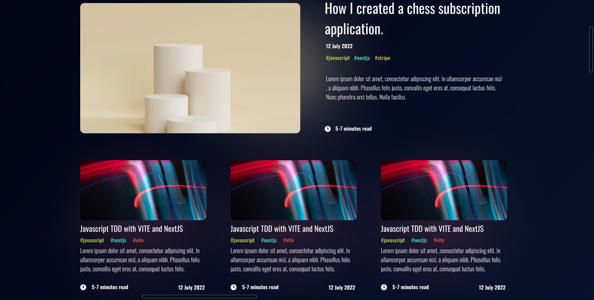

# Nodejs Blog


## Description

Nodejs Blog is a web application built with Node.js, Express, MongoDB, EJS, and Tailwind CSS. It provides a platform for administrators to post blogs and allows visitors to view and comment on the blogs. To interact with the commenting feature, visitors need to either log in or create an account.


## Socials network


## Tech


## Table of Contents

- [Nodejs Blog](#nodejs-blog)
  - [Description](#description)
  - [Socials network](#socials-network)
  - [Tech](#tech)
  - [Table of Contents](#table-of-contents)
  - [Installation](#installation)
  - [Usage](#usage)
  - [Features](#features)
  - [Technologies](#technologies)
  - [Contributing](#contributing)

## Installation

1. Clone the repository:

   ```bash
   git clone https://github.com/os-humble-man/nodejs-blog.git
2. Navigate to the project directory:

    ```bash
    cd nodejs-blog
3. Install dependencies:

    ```bash
    npm install
4. Set up your MongoDB database and update the configuration in the project.
5. Start the application:

    ```bash
    npm start
## Usage
Visit  `http://localhost:3000` in your web browser.

- Administrators can log in and post blogs.
- Visitors can view blogs and comment after logging in or creating an account.
  
## Features

- Administrator Blog Posting
- Visitor Blog Viewing
- Visitor Commenting (requires login or account creation)

## Technologies

- Node.js
- Express
- MongoDB
- EJS (Embedded JavaScript)
- Tailwind CSS

## Contributing
If you would like to contribute to the project, please follow these guidelines:

1. Fork the repository.
2. Create a new branch for your feature or bug fix.
3. Make your changes and submit a pull request.


